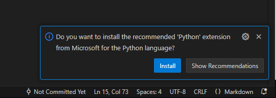

# pdfMerger
Outil pour concatener/merger des fichiers PDF

## Windows
### Outils
Les outils à avoir pour lancer le script:
- VSCode: https://code.visualstudio.com/
- Python: la version compatible avec votre ordinateur
- Le projet pdfMerger à télécharger en .zip

### Setup
- Décompresser pdfMerger
- Ouvrir VSCode
    - File -> Add Folder to Workspace et selectionner pdfMerger
    - VSCode va vous proposer d'installer l'extension Python, faites le.

    - Ouvrir pdfMerger.py
    - Click droit n'importe où dans le fichier et cliquer sur "Run Python" -> "Run Python File in Terminal"

    - Ca ne va pas marcher et c'est normal car il vous manque pypdf.
    - Installer pypdf: `pip install pypdf`
    - Si il vous propose de mettre à jour pip, executez la ligne qu'il vous donne.
    - Vous pouvez maintenant executer le programme:  
`python3 pdfMerger\pdfMerger.py "path\ficher1.pdf" "path\fichier2.pdf" -o path\output.pdf`  
Il faut au minimum deux fichiers mais le programme fonctionne avec autant de fichier que vous voulez.


## Linux
### Setup
```
# Check python version
python3 --version

# Si python <= 3.6
pip install "PyPDF2<2.0"

# Si python >= 3.7
pip install pypdf
```

### How to use it
```
python3 ./pdfMerger.py fichier1 fichier2 ... [-o nom_du_fichier] 
```

Vous pouvez renseigner le fichier de sorti avec l'option `-o nom_du_fichier` 

## Windows
